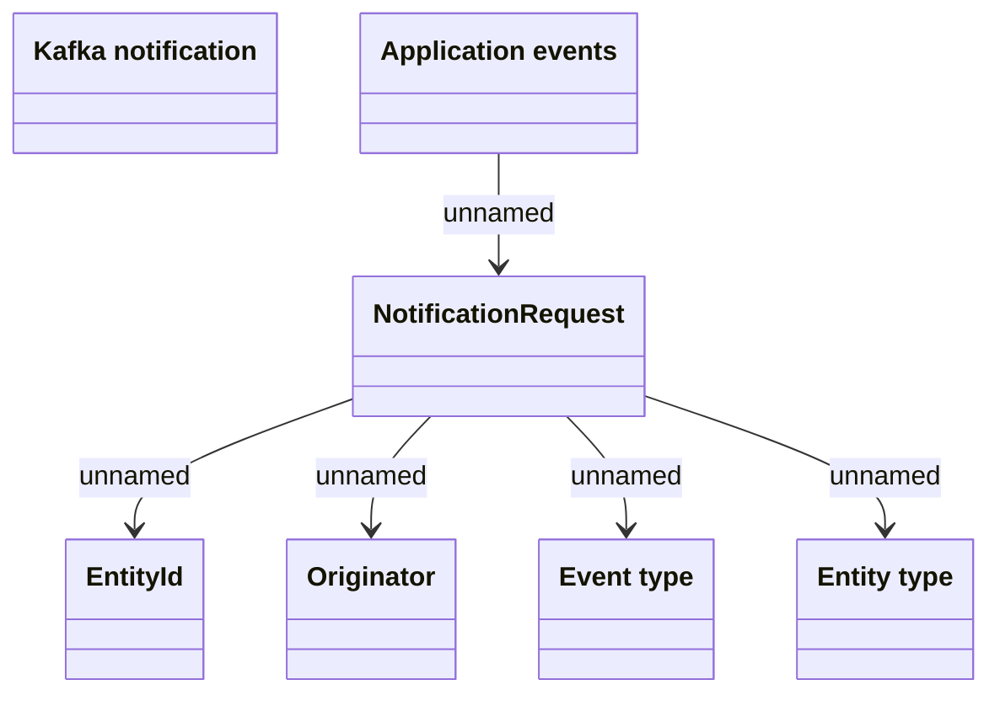

# Notification

```mermaid
classDiagram
    class Kafka_notification["Kafka notification"]
    class Entity_type["Entity type"]
    class Event_type["Event type"]
    class Originator["Originator"]
    class EntityId["EntityId"]
    class NotificationRequest["NotificationRequest"]
    class Application_events["Application events"]
    Application_events --> NotificationRequest : unnamed
    NotificationRequest --> EntityId : unnamed
    NotificationRequest --> Originator : unnamed
    NotificationRequest --> Event_type : unnamed
    NotificationRequest --> Entity_type : unnamed
```
