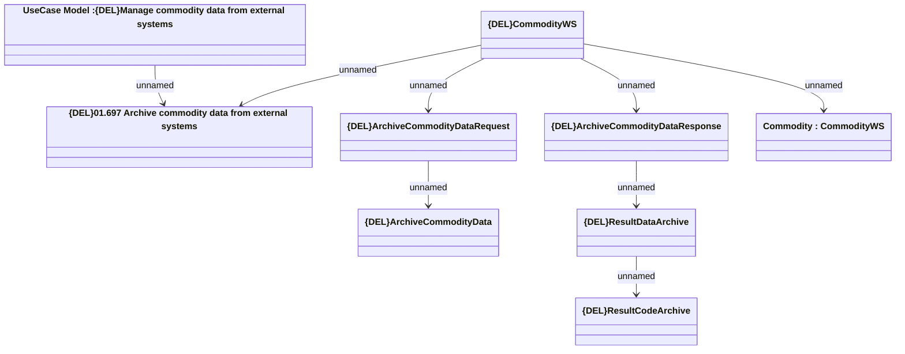

# {DEL}ArchiveCommodityData

```mermaid
classDiagram
    class DEL_ArchiveCommodityData["{DEL}ArchiveCommodityData"]
    class UseCase_Model_DEL_Manage_commodity_data_from_external_system["UseCase Model :{DEL}Manage commodity data from external systems"]
    class DEL_01_697_Archive_commodity_data_from_external_systems["{DEL}01.697 Archive commodity data from external systems"]
    class DEL_ResultCodeArchive["{DEL}ResultCodeArchive"]
    class DEL_ResultDataArchive["{DEL}ResultDataArchive"]
    class DEL_ArchiveCommodityDataResponse["{DEL}ArchiveCommodityDataResponse"]
    class DEL_ArchiveCommodityDataRequest["{DEL}ArchiveCommodityDataRequest"]
    class Commodity_CommodityWS["Commodity : CommodityWS"]
    class DEL_CommodityWS["{DEL}CommodityWS"]
    DEL_ArchiveCommodityDataResponse --> DEL_ResultDataArchive : unnamed
    DEL_ResultDataArchive --> DEL_ResultCodeArchive : unnamed
    DEL_ArchiveCommodityDataRequest --> DEL_ArchiveCommodityData : unnamed
    UseCase_Model_DEL_Manage_commodity_data_from_external_system --> DEL_01_697_Archive_commodity_data_from_external_systems : unnamed
    DEL_CommodityWS --> Commodity_CommodityWS : unnamed
    DEL_CommodityWS --> DEL_ArchiveCommodityDataRequest : unnamed
    DEL_CommodityWS --> DEL_01_697_Archive_commodity_data_from_external_systems : unnamed
    DEL_CommodityWS --> DEL_ArchiveCommodityDataResponse : unnamed
```
