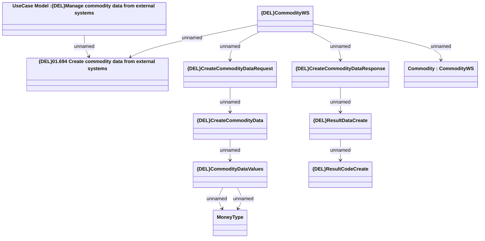

# CreateCommodityData

```mermaid
classDiagram
    class DEL_CreateCommodityData["{DEL}CreateCommodityData"]
    class DEL_CommodityDataValues["{DEL}CommodityDataValues"]
    class UseCase_Model_DEL_Manage_commodity_data_from_external_system["UseCase Model :{DEL}Manage commodity data from external systems"]
    class DEL_01_694_Create_commodity_data_from_external_systems["{DEL}01.694 Create commodity data from external systems"]
    class MoneyType["MoneyType"]
    class DEL_ResultCodeCreate["{DEL}ResultCodeCreate"]
    class DEL_ResultDataCreate["{DEL}ResultDataCreate"]
    class DEL_CreateCommodityDataResponse["{DEL}CreateCommodityDataResponse"]
    class DEL_CreateCommodityDataRequest["{DEL}CreateCommodityDataRequest"]
    class DEL_CommodityWS["{DEL}CommodityWS"]
    class Commodity_CommodityWS["Commodity : CommodityWS"]
    DEL_CreateCommodityDataResponse --> DEL_ResultDataCreate : unnamed
    DEL_ResultDataCreate --> DEL_ResultCodeCreate : unnamed
    UseCase_Model_DEL_Manage_commodity_data_from_external_system --> DEL_01_694_Create_commodity_data_from_external_systems : unnamed
    DEL_CreateCommodityData --> DEL_CommodityDataValues : unnamed
    DEL_CreateCommodityDataRequest --> DEL_CreateCommodityData : unnamed
    DEL_CommodityWS --> Commodity_CommodityWS : unnamed
    DEL_CommodityWS --> DEL_01_694_Create_commodity_data_from_external_systems : unnamed
    DEL_CommodityWS --> DEL_CreateCommodityDataResponse : unnamed
    DEL_CommodityWS --> DEL_CreateCommodityDataRequest : unnamed
    DEL_CommodityDataValues --> MoneyType : unnamed
    DEL_CommodityDataValues --> MoneyType : unnamed
```
