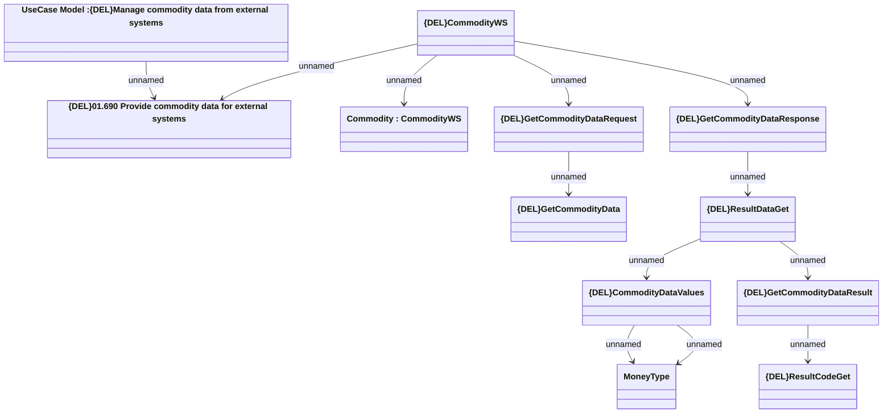

# {DEL}GetCommodityData

```mermaid
classDiagram
    class DEL_GetCommodityData["{DEL}GetCommodityData"]
    class MoneyType["MoneyType"]
    class DEL_CommodityWS["{DEL}CommodityWS"]
    class DEL_ResultDataGet["{DEL}ResultDataGet"]
    class UseCase_Model_DEL_Manage_commodity_data_from_external_system["UseCase Model :{DEL}Manage commodity data from external systems"]
    class DEL_ResultCodeGet["{DEL}ResultCodeGet"]
    class DEL_GetCommodityDataResult["{DEL}GetCommodityDataResult"]
    class DEL_01_690_Provide_commodity_data_for_external_systems["{DEL}01.690 Provide commodity data for external systems"]
    class DEL_CommodityDataValues["{DEL}CommodityDataValues"]
    class Commodity_CommodityWS["Commodity : CommodityWS"]
    class DEL_GetCommodityDataResponse["{DEL}GetCommodityDataResponse"]
    class DEL_GetCommodityDataRequest["{DEL}GetCommodityDataRequest"]
    DEL_CommodityWS --> DEL_GetCommodityDataRequest : unnamed
    DEL_CommodityWS --> DEL_GetCommodityDataResponse : unnamed
    DEL_CommodityWS --> Commodity_CommodityWS : unnamed
    DEL_ResultDataGet --> DEL_CommodityDataValues : unnamed
    DEL_CommodityWS --> DEL_01_690_Provide_commodity_data_for_external_systems : unnamed
    UseCase_Model_DEL_Manage_commodity_data_from_external_system --> DEL_01_690_Provide_commodity_data_for_external_systems : unnamed
    DEL_ResultDataGet --> DEL_GetCommodityDataResult : unnamed
    DEL_GetCommodityDataResult --> DEL_ResultCodeGet : unnamed
    DEL_GetCommodityDataResponse --> DEL_ResultDataGet : unnamed
    DEL_CommodityDataValues --> MoneyType : unnamed
    DEL_CommodityDataValues --> MoneyType : unnamed
    DEL_GetCommodityDataRequest --> DEL_GetCommodityData : unnamed
```
