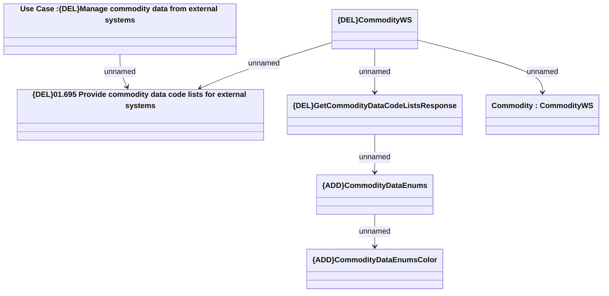

# {DEL}GetCommodityDataCodeLists

```mermaid
classDiagram
    class Use_Case_DEL_Manage_commodity_data_from_external_systems["Use Case :{DEL}Manage commodity data from external systems"]
    class DEL_01_695_Provide_commodity_data_code_lists_for_external_sy["{DEL}01.695 Provide commodity data code lists for external systems"]
    class ADD_CommodityDataEnumsColor["{ADD}CommodityDataEnumsColor"]
    class ADD_CommodityDataEnums["{ADD}CommodityDataEnums"]
    class DEL_GetCommodityDataCodeListsResponse["{DEL}GetCommodityDataCodeListsResponse"]
    class Commodity_CommodityWS["Commodity : CommodityWS"]
    class DEL_CommodityWS["{DEL}CommodityWS"]
    DEL_GetCommodityDataCodeListsResponse --> ADD_CommodityDataEnums : unnamed
    ADD_CommodityDataEnums --> ADD_CommodityDataEnumsColor : unnamed
    Use_Case_DEL_Manage_commodity_data_from_external_systems --> DEL_01_695_Provide_commodity_data_code_lists_for_external_sy : unnamed
    DEL_CommodityWS --> Commodity_CommodityWS : unnamed
    DEL_CommodityWS --> DEL_01_695_Provide_commodity_data_code_lists_for_external_sy : unnamed
    DEL_CommodityWS --> DEL_GetCommodityDataCodeListsResponse : unnamed
```
