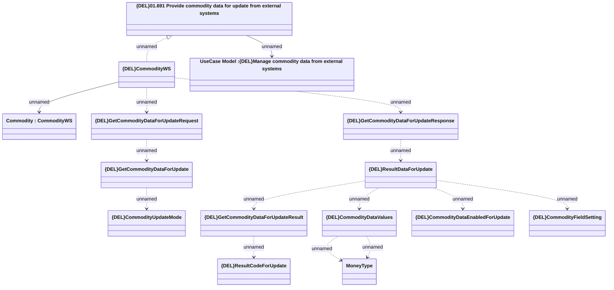

# GetCommodityDataForUpdate

- **Diagram Type**: Logical
- **Package**: HomerSelect/BSL/Modules/Commodity/Analytical Model/Commodity Data/Interface Provided/{DEL}GetCommodityDataForUpdate
- **Diagram ID**: 150905
- **Elements**: 15
- **Connectors**: 15

