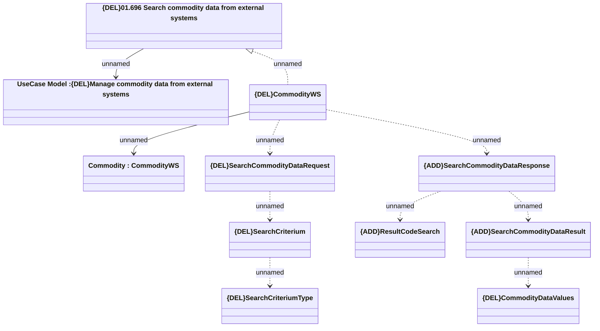

# SearchCommodityData

- **Diagram Type**: Logical
- **Package**: HomerSelect/BSL/Modules/Commodity/Analytical Model/Commodity Data/Interface Provided/{DEL}SearchCommodityData
- **Diagram ID**: 150901
- **Elements**: 11
- **Connectors**: 10

