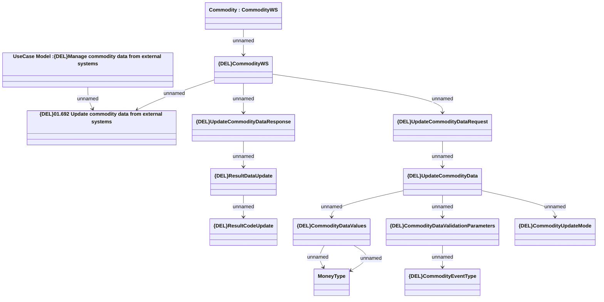

# UpdateCommodityData

```mermaid
classDiagram
    class MoneyType["MoneyType"]
    class DEL_CommodityDataValues["{DEL}CommodityDataValues"]
    class DEL_UpdateCommodityData["{DEL}UpdateCommodityData"]
    class DEL_CommodityEventType["{DEL}CommodityEventType"]
    class DEL_CommodityDataValidationParameters["{DEL}CommodityDataValidationParameters"]
    class DEL_UpdateCommodityDataResponse["{DEL}UpdateCommodityDataResponse"]
    class DEL_CommodityUpdateMode["{DEL}CommodityUpdateMode"]
    class UseCase_Model_DEL_Manage_commodity_data_from_external_system["UseCase Model :{DEL}Manage commodity data from external systems"]
    class DEL_01_692_Update_commodity_data_from_external_systems["{DEL}01.692 Update commodity data from external systems"]
    class DEL_ResultCodeUpdate["{DEL}ResultCodeUpdate"]
    class DEL_ResultDataUpdate["{DEL}ResultDataUpdate"]
    class DEL_UpdateCommodityDataRequest["{DEL}UpdateCommodityDataRequest"]
    class Commodity_CommodityWS["Commodity : CommodityWS"]
    class DEL_CommodityWS["{DEL}CommodityWS"]
    Commodity_CommodityWS --> DEL_CommodityWS : unnamed
    DEL_UpdateCommodityDataResponse --> DEL_ResultDataUpdate : unnamed
    DEL_ResultDataUpdate --> DEL_ResultCodeUpdate : unnamed
    DEL_UpdateCommodityData --> DEL_CommodityUpdateMode : unnamed
    DEL_UpdateCommodityData --> DEL_CommodityDataValidationParameters : unnamed
    DEL_UpdateCommodityDataRequest --> DEL_UpdateCommodityData : unnamed
    DEL_UpdateCommodityData --> DEL_CommodityDataValues : unnamed
    DEL_CommodityWS --> DEL_UpdateCommodityDataRequest : unnamed
    DEL_CommodityWS --> DEL_UpdateCommodityDataResponse : unnamed
    DEL_CommodityWS --> DEL_01_692_Update_commodity_data_from_external_systems : unnamed
    DEL_CommodityDataValues --> MoneyType : unnamed
    DEL_CommodityDataValues --> MoneyType : unnamed
    DEL_CommodityDataValidationParameters --> DEL_CommodityEventType : unnamed
    UseCase_Model_DEL_Manage_commodity_data_from_external_system --> DEL_01_692_Update_commodity_data_from_external_systems : unnamed
```
