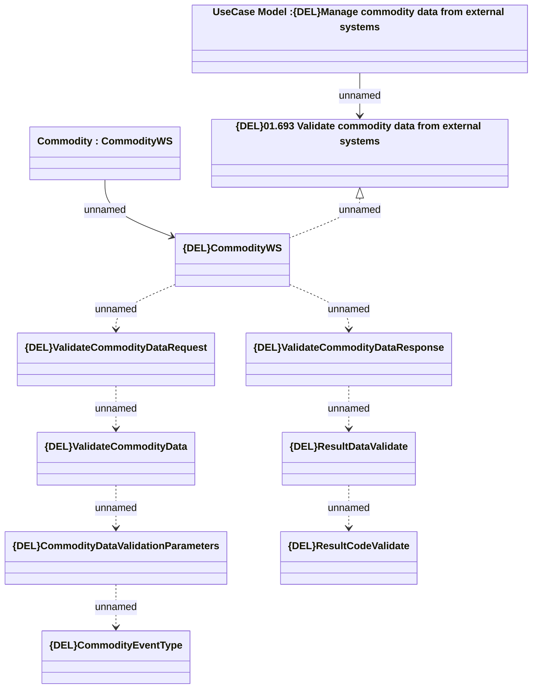

# {DEL}ValidateCommodityData

- **Diagram Type**: Logical
- **Package**: HomerSelect/BSL/Modules/Commodity/Analytical Model/Commodity Data/Interface Provided/{DEL}ValidateCommodityData
- **Diagram ID**: 150903
- **Elements**: 11
- **Connectors**: 10

