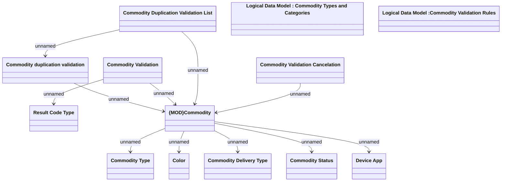

# Commodity Data

```mermaid
classDiagram
    class Commodity_Duplication_Validation_List["Commodity Duplication Validation List"]
    class Device_App["Device App"]
    class Commodity_duplication_validation["Commodity duplication validation"]
    class Commodity_Validation_Cancelation["Commodity Validation Cancelation"]
    class Commodity_Status["Commodity Status"]
    class Logical_Data_Model_Commodity_Types_and_Categories["Logical Data Model : Commodity Types and Categories"]
    class Logical_Data_Model_Commodity_Validation_Rules["Logical Data Model :Commodity Validation Rules"]
    class Commodity_Delivery_Type["Commodity Delivery Type"]
    class Color["Color"]
    class Result_Code_Type["Result Code Type"]
    class Commodity_Validation["Commodity Validation"]
    class Commodity_Type["Commodity Type"]
    class MOD_Commodity["{MOD}Commodity"]
    Commodity_duplication_validation --> MOD_Commodity : unnamed
    Commodity_Validation --> MOD_Commodity : unnamed
    Commodity_Duplication_Validation_List --> MOD_Commodity : unnamed
    Commodity_Validation_Cancelation --> MOD_Commodity : unnamed
    MOD_Commodity --> Commodity_Type : unnamed
    Commodity_Validation --> Result_Code_Type : unnamed
    MOD_Commodity --> Color : unnamed
    MOD_Commodity --> Commodity_Delivery_Type : unnamed
    MOD_Commodity --> Commodity_Status : unnamed
    Commodity_Duplication_Validation_List --> Commodity_duplication_validation : unnamed
    MOD_Commodity --> Device_App : unnamed
```
