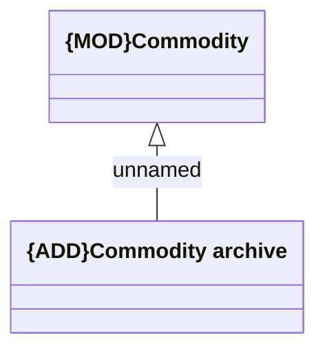

# Commodity data archive

- **Diagram Type**: Logical
- **Package**: HomerSelect/BSL/Modules/Commodity/Analytical Model/Commodity Data/Logical Data Model
- **Diagram ID**: 164436
- **Elements**: 2
- **Connectors**: 1

