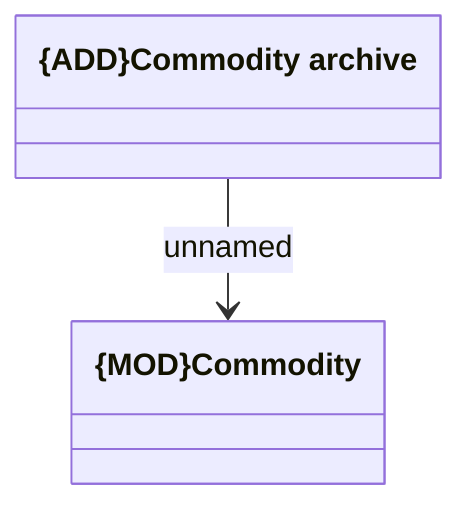

# Commodity data archive

```mermaid
classDiagram
    class MOD_Commodity["{MOD}Commodity"]
    class ADD_Commodity_archive["{ADD}Commodity archive"]
    ADD_Commodity_archive --> MOD_Commodity : unnamed
```
