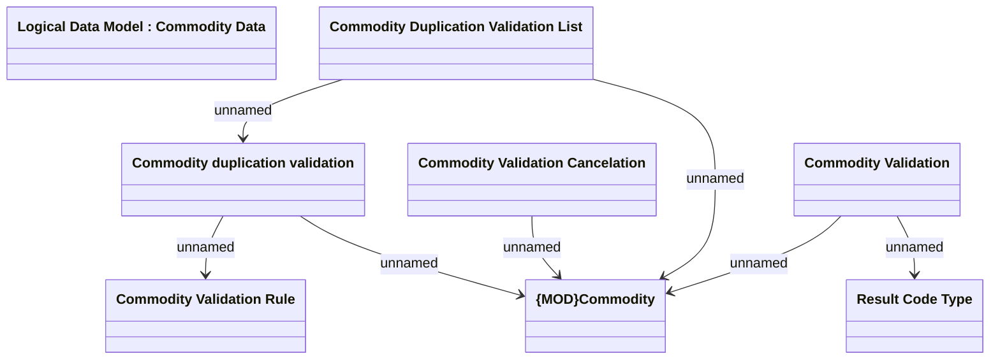

# Commodity validation log

```mermaid
classDiagram
    class Logical_Data_Model_Commodity_Data["Logical Data Model : Commodity Data"]
    class Commodity_Duplication_Validation_List["Commodity Duplication Validation List"]
    class Commodity_Validation_Rule["Commodity Validation Rule"]
    class Result_Code_Type["Result Code Type"]
    class Commodity_duplication_validation["Commodity duplication validation"]
    class Commodity_Validation_Cancelation["Commodity Validation Cancelation"]
    class Commodity_Validation["Commodity Validation"]
    class MOD_Commodity["{MOD}Commodity"]
    Commodity_duplication_validation --> MOD_Commodity : unnamed
    Commodity_Validation_Cancelation --> MOD_Commodity : unnamed
    Commodity_Duplication_Validation_List --> MOD_Commodity : unnamed
    Commodity_Validation --> MOD_Commodity : unnamed
    Commodity_Duplication_Validation_List --> Commodity_duplication_validation : unnamed
    Commodity_Validation --> Result_Code_Type : unnamed
    Commodity_duplication_validation --> Commodity_Validation_Rule : unnamed
```
