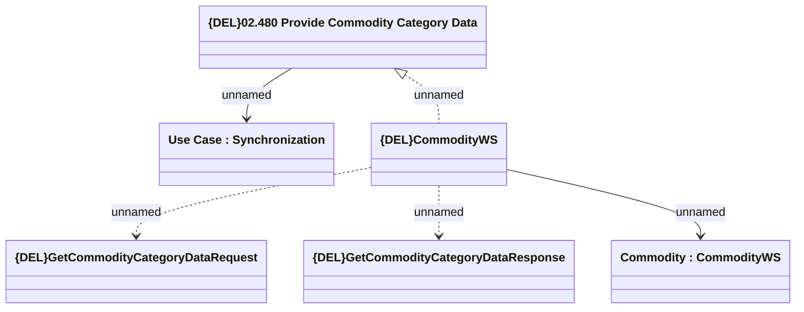

# {DEL}GetCommodityCategoryData

- **Diagram Type**: Logical
- **Package**: HomerSelect/BSL/Modules/Commodity/Analytical Model/Commodity Definition/Interface Provided
- **Diagram ID**: 150992
- **Elements**: 6
- **Connectors**: 5

