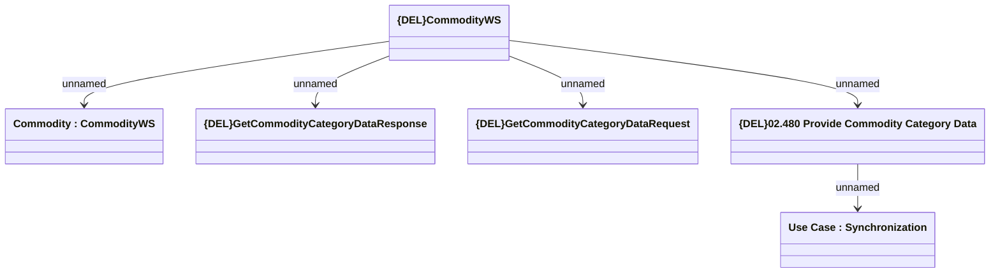

# {DEL}GetCommodityCategoryData

```mermaid
classDiagram
    class Commodity_CommodityWS["Commodity : CommodityWS"]
    class Use_Case_Synchronization["Use Case : Synchronization"]
    class DEL_GetCommodityCategoryDataResponse["{DEL}GetCommodityCategoryDataResponse"]
    class DEL_GetCommodityCategoryDataRequest["{DEL}GetCommodityCategoryDataRequest"]
    class DEL_02_480_Provide_Commodity_Category_Data["{DEL}02.480 Provide Commodity Category Data"]
    class DEL_CommodityWS["{DEL}CommodityWS"]
    DEL_CommodityWS --> DEL_02_480_Provide_Commodity_Category_Data : unnamed
    DEL_CommodityWS --> DEL_GetCommodityCategoryDataRequest : unnamed
    DEL_CommodityWS --> DEL_GetCommodityCategoryDataResponse : unnamed
    DEL_CommodityWS --> Commodity_CommodityWS : unnamed
    DEL_02_480_Provide_Commodity_Category_Data --> Use_Case_Synchronization : unnamed
```
