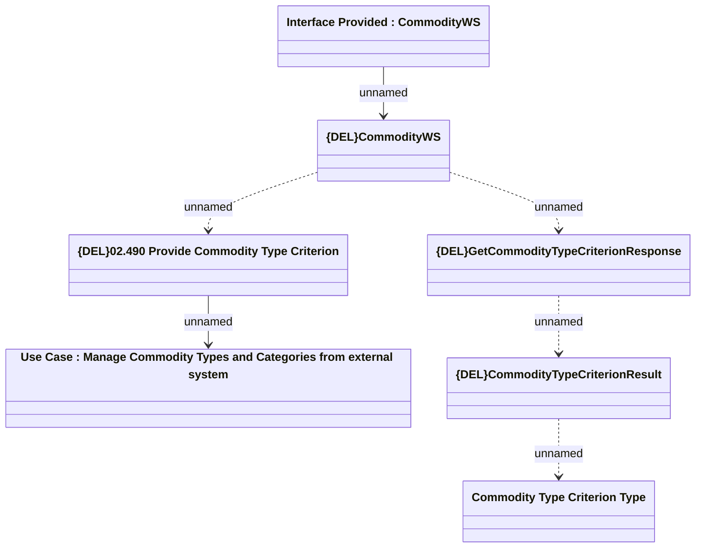

# {DEL}GetCommodityTypeCriterion

- **Diagram Type**: Logical
- **Package**: HomerSelect/BSL/Modules/Commodity/Analytical Model/Commodity Definition/Interface Provided
- **Diagram ID**: 150994
- **Elements**: 7
- **Connectors**: 6

