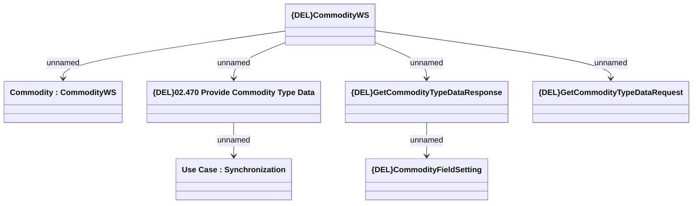

# {DEL}GetCommodityTypeData

```mermaid
classDiagram
    class DEL_CommodityFieldSetting["{DEL}CommodityFieldSetting"]
    class Commodity_CommodityWS["Commodity : CommodityWS"]
    class Use_Case_Synchronization["Use Case : Synchronization"]
    class DEL_GetCommodityTypeDataResponse["{DEL}GetCommodityTypeDataResponse"]
    class DEL_02_470_Provide_Commodity_Type_Data["{DEL}02.470 Provide Commodity Type Data"]
    class DEL_GetCommodityTypeDataRequest["{DEL}GetCommodityTypeDataRequest"]
    class DEL_CommodityWS["{DEL}CommodityWS"]
    DEL_CommodityWS --> DEL_GetCommodityTypeDataRequest : unnamed
    DEL_CommodityWS --> DEL_02_470_Provide_Commodity_Type_Data : unnamed
    DEL_CommodityWS --> DEL_GetCommodityTypeDataResponse : unnamed
    DEL_CommodityWS --> Commodity_CommodityWS : unnamed
    DEL_GetCommodityTypeDataResponse --> DEL_CommodityFieldSetting : unnamed
    DEL_02_470_Provide_Commodity_Type_Data --> Use_Case_Synchronization : unnamed
```
