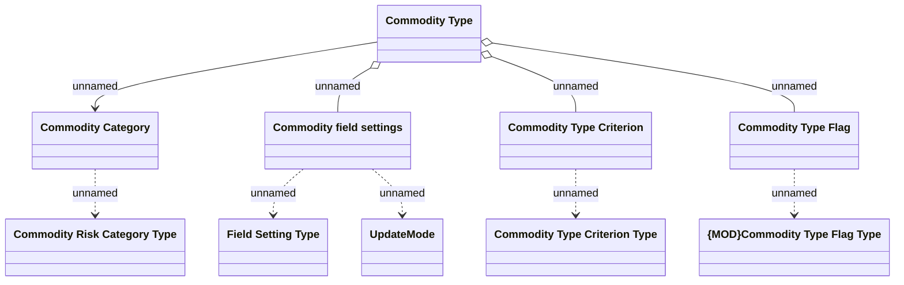

# Commodity Types and Categories

- **Diagram Type**: Logical
- **Package**: HomerSelect/BSL/Modules/Commodity/Analytical Model/Commodity Definition/Logical Data Model
- **Diagram ID**: 152301
- **Elements**: 10
- **Connectors**: 9

