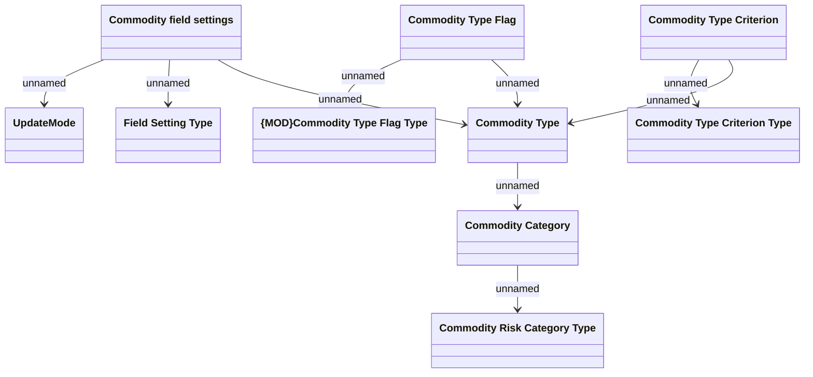

# Commodity Types and Categories

```mermaid
classDiagram
    class UpdateMode["UpdateMode"]
    class Field_Setting_Type["Field Setting Type"]
    class Commodity_field_settings["Commodity field settings"]
    class Commodity_Type_Criterion_Type["Commodity Type Criterion Type"]
    class Commodity_Type_Criterion["Commodity Type Criterion"]
    class Commodity_Risk_Category_Type["Commodity Risk Category Type"]
    class MOD_Commodity_Type_Flag_Type["{MOD}Commodity Type Flag Type"]
    class Commodity_Type_Flag["Commodity Type Flag"]
    class Commodity_Type["Commodity Type"]
    class Commodity_Category["Commodity Category"]
    Commodity_Type --> Commodity_Category : unnamed
    Commodity_field_settings --> Commodity_Type : unnamed
    Commodity_Type_Criterion --> Commodity_Type : unnamed
    Commodity_Type_Flag --> Commodity_Type : unnamed
    Commodity_Type_Flag --> MOD_Commodity_Type_Flag_Type : unnamed
    Commodity_Category --> Commodity_Risk_Category_Type : unnamed
    Commodity_Type_Criterion --> Commodity_Type_Criterion_Type : unnamed
    Commodity_field_settings --> Field_Setting_Type : unnamed
    Commodity_field_settings --> UpdateMode : unnamed
```
