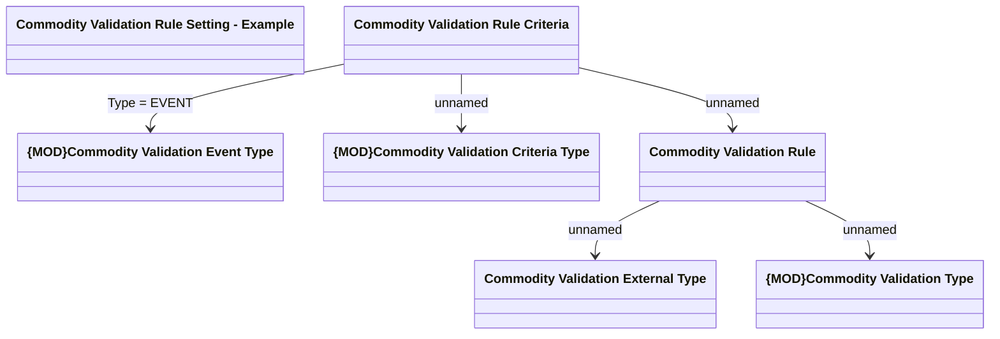

# Commodity Validation Rules

```mermaid
classDiagram
    class Commodity_Validation_Rule_Setting_Example["Commodity Validation Rule Setting - Example"]
    class MOD_Commodity_Validation_Event_Type["{MOD}Commodity Validation Event Type"]
    class MOD_Commodity_Validation_Type["{MOD}Commodity Validation Type"]
    class Commodity_Validation_Rule_Criteria["Commodity Validation Rule Criteria"]
    class MOD_Commodity_Validation_Criteria_Type["{MOD}Commodity Validation Criteria Type"]
    class Commodity_Validation_External_Type["Commodity Validation External Type"]
    class Commodity_Validation_Rule["Commodity Validation Rule"]
    Commodity_Validation_Rule_Criteria --> Commodity_Validation_Rule : unnamed
    Commodity_Validation_Rule --> Commodity_Validation_External_Type : unnamed
    Commodity_Validation_Rule_Criteria --> MOD_Commodity_Validation_Criteria_Type : unnamed
    Commodity_Validation_Rule --> MOD_Commodity_Validation_Type : unnamed
    Commodity_Validation_Rule_Criteria --> MOD_Commodity_Validation_Event_Type : Type = EVENT 
```
