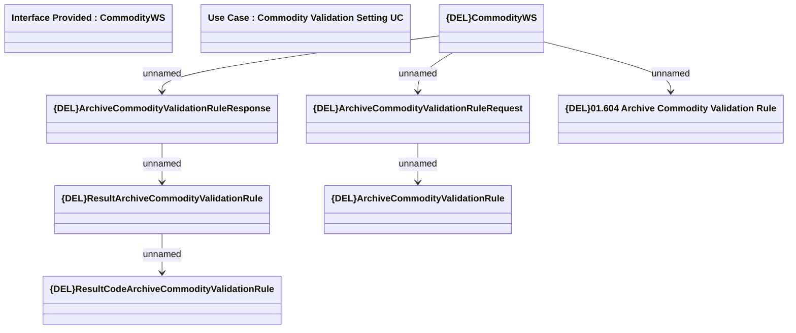

# ArchiveCommodityValidationRule

```mermaid
classDiagram
    class DEL_ResultCodeArchiveCommodityValidationRule["{DEL}ResultCodeArchiveCommodityValidationRule"]
    class DEL_ResultArchiveCommodityValidationRule["{DEL}ResultArchiveCommodityValidationRule"]
    class DEL_ArchiveCommodityValidationRuleResponse["{DEL}ArchiveCommodityValidationRuleResponse"]
    class DEL_ArchiveCommodityValidationRuleRequest["{DEL}ArchiveCommodityValidationRuleRequest"]
    class DEL_ArchiveCommodityValidationRule["{DEL}ArchiveCommodityValidationRule"]
    class DEL_01_604_Archive_Commodity_Validation_Rule["{DEL}01.604 Archive Commodity Validation Rule"]
    class Interface_Provided_CommodityWS["Interface Provided : CommodityWS"]
    class Use_Case_Commodity_Validation_Setting_UC["Use Case : Commodity Validation Setting UC"]
    class DEL_CommodityWS["{DEL}CommodityWS"]
    DEL_CommodityWS --> DEL_01_604_Archive_Commodity_Validation_Rule : unnamed
    DEL_ArchiveCommodityValidationRuleRequest --> DEL_ArchiveCommodityValidationRule : unnamed
    DEL_CommodityWS --> DEL_ArchiveCommodityValidationRuleRequest : unnamed
    DEL_CommodityWS --> DEL_ArchiveCommodityValidationRuleResponse : unnamed
    DEL_ArchiveCommodityValidationRuleResponse --> DEL_ResultArchiveCommodityValidationRule : unnamed
    DEL_ResultArchiveCommodityValidationRule --> DEL_ResultCodeArchiveCommodityValidationRule : unnamed
```
