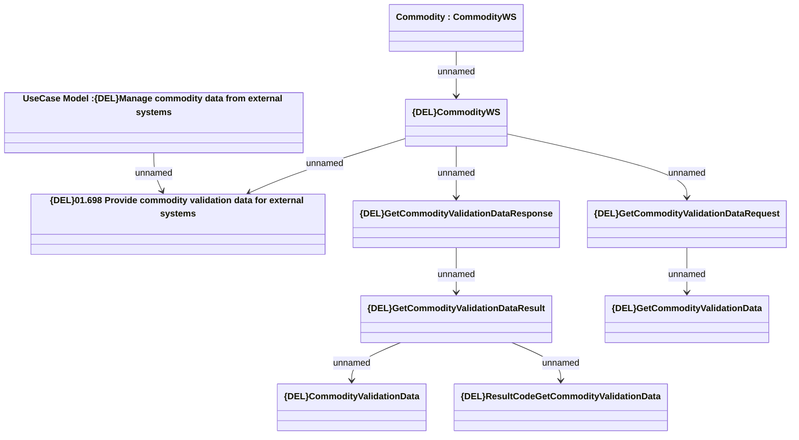

# GetCommodityValidationData

```mermaid
classDiagram
    class UseCase_Model_DEL_Manage_commodity_data_from_external_system["UseCase Model :{DEL}Manage commodity data from external systems"]
    class DEL_01_698_Provide_commodity_validation_data_for_external_sy["{DEL}01.698 Provide commodity validation data for external systems"]
    class DEL_ResultCodeGetCommodityValidationData["{DEL}ResultCodeGetCommodityValidationData"]
    class DEL_CommodityValidationData["{DEL}CommodityValidationData"]
    class DEL_GetCommodityValidationDataResult["{DEL}GetCommodityValidationDataResult"]
    class DEL_GetCommodityValidationDataResponse["{DEL}GetCommodityValidationDataResponse"]
    class DEL_GetCommodityValidationData["{DEL}GetCommodityValidationData"]
    class DEL_GetCommodityValidationDataRequest["{DEL}GetCommodityValidationDataRequest"]
    class Commodity_CommodityWS["Commodity : CommodityWS"]
    class DEL_CommodityWS["{DEL}CommodityWS"]
    Commodity_CommodityWS --> DEL_CommodityWS : unnamed
    DEL_CommodityWS --> DEL_GetCommodityValidationDataRequest : unnamed
    DEL_GetCommodityValidationDataRequest --> DEL_GetCommodityValidationData : unnamed
    DEL_CommodityWS --> DEL_GetCommodityValidationDataResponse : unnamed
    DEL_GetCommodityValidationDataResponse --> DEL_GetCommodityValidationDataResult : unnamed
    DEL_GetCommodityValidationDataResult --> DEL_CommodityValidationData : unnamed
    DEL_GetCommodityValidationDataResult --> DEL_ResultCodeGetCommodityValidationData : unnamed
    DEL_CommodityWS --> DEL_01_698_Provide_commodity_validation_data_for_external_sy : unnamed
    UseCase_Model_DEL_Manage_commodity_data_from_external_system --> DEL_01_698_Provide_commodity_validation_data_for_external_sy : unnamed
```
