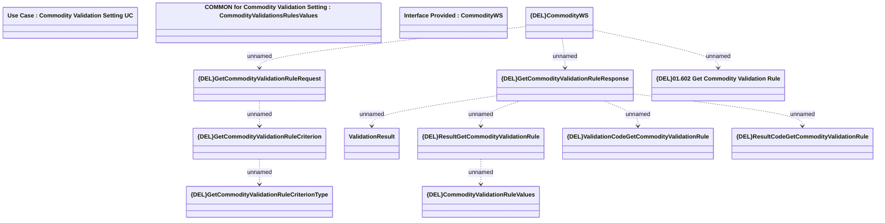

# GetCommodityValidationRule

- **Diagram Type**: Logical
- **Package**: HomerSelect/BSL/Modules/Commodity/Analytical Model/Commodity Validation Setting/Provided Services/Interface Provided/{DEL}GetCommodityValidationRule
- **Diagram ID**: 150978
- **Elements**: 14
- **Connectors**: 10

