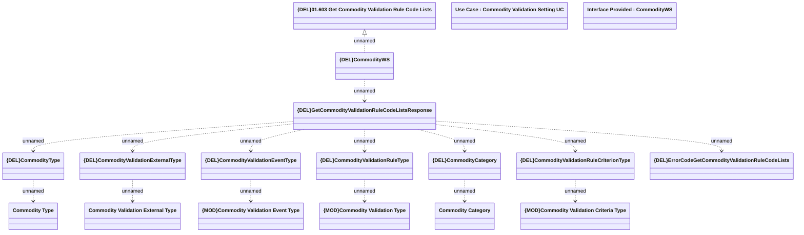

# GetCommodityValidationRuleCodeLists

- **Diagram Type**: Logical
- **Package**: HomerSelect/BSL/Modules/Commodity/Analytical Model/Commodity Validation Setting/Provided Services/Interface Provided/{DEL}GetCommodityValidationRuleCodeLists
- **Diagram ID**: 150979
- **Elements**: 19
- **Connectors**: 15

