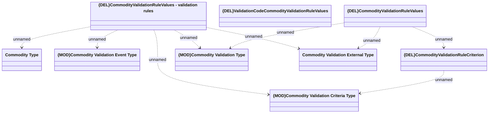

# {DEL}CommodityValidationsRulesValues

- **Diagram Type**: Logical
- **Package**: HomerSelect/BSL/Modules/Commodity/Analytical Model/Commodity Validation Setting/Provided Services/Interface Provided/{DEL}COMMON for Commodity Validation Setting
- **Diagram ID**: 150981
- **Elements**: 9
- **Connectors**: 9

