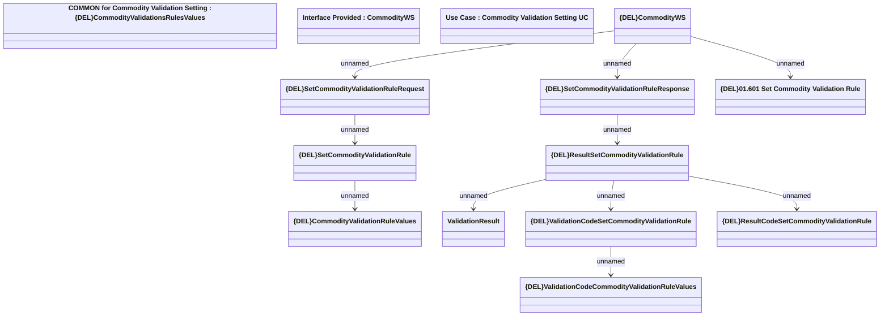

# {DEL}SetCommodityValidationRule

```mermaid
classDiagram
    class DEL_ResultCodeSetCommodityValidationRule["{DEL}ResultCodeSetCommodityValidationRule"]
    class DEL_ResultSetCommodityValidationRule["{DEL}ResultSetCommodityValidationRule"]
    class DEL_ValidationCodeSetCommodityValidationRule["{DEL}ValidationCodeSetCommodityValidationRule"]
    class DEL_ValidationCodeCommodityValidationRuleValues["{DEL}ValidationCodeCommodityValidationRuleValues"]
    class COMMON_for_Commodity_Validation_Setting_DEL_CommodityValidat["COMMON for Commodity Validation Setting :{DEL}CommodityValidationsRulesValues"]
    class DEL_CommodityValidationRuleValues["{DEL}CommodityValidationRuleValues"]
    class DEL_SetCommodityValidationRule["{DEL}SetCommodityValidationRule"]
    class Interface_Provided_CommodityWS["Interface Provided : CommodityWS"]
    class Use_Case_Commodity_Validation_Setting_UC["Use Case : Commodity Validation Setting UC"]
    class DEL_01_601_Set_Commodity_Validation_Rule["{DEL}01.601 Set Commodity Validation Rule"]
    class DEL_SetCommodityValidationRuleResponse["{DEL}SetCommodityValidationRuleResponse"]
    class DEL_SetCommodityValidationRuleRequest["{DEL}SetCommodityValidationRuleRequest"]
    class DEL_CommodityWS["{DEL}CommodityWS"]
    class ValidationResult["ValidationResult"]
    DEL_ResultSetCommodityValidationRule --> ValidationResult : unnamed
    DEL_CommodityWS --> DEL_SetCommodityValidationRuleRequest : unnamed
    DEL_CommodityWS --> DEL_SetCommodityValidationRuleResponse : unnamed
    DEL_CommodityWS --> DEL_01_601_Set_Commodity_Validation_Rule : unnamed
    DEL_SetCommodityValidationRuleRequest --> DEL_SetCommodityValidationRule : unnamed
    DEL_SetCommodityValidationRule --> DEL_CommodityValidationRuleValues : unnamed
    DEL_ValidationCodeSetCommodityValidationRule --> DEL_ValidationCodeCommodityValidationRuleValues : unnamed
    DEL_ResultSetCommodityValidationRule --> DEL_ValidationCodeSetCommodityValidationRule : unnamed
    DEL_SetCommodityValidationRuleResponse --> DEL_ResultSetCommodityValidationRule : unnamed
    DEL_ResultSetCommodityValidationRule --> DEL_ResultCodeSetCommodityValidationRule : unnamed
```
