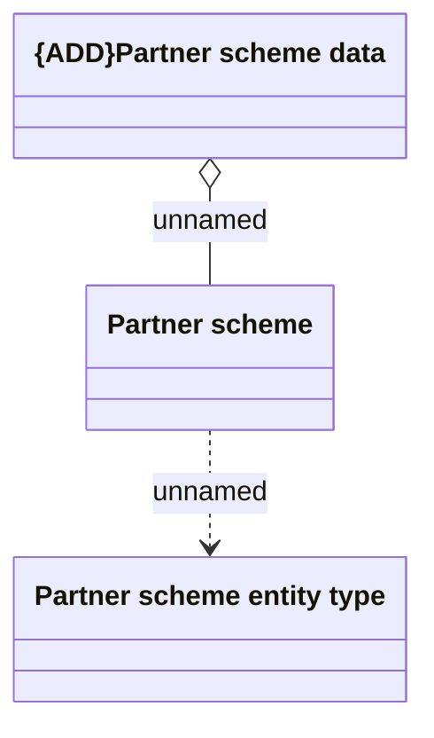

# Partner scheme code

- **Diagram Type**: Logical
- **Package**: HomerSelect/BSL/Modules/Commodity/Analytical Model/Partner scheme code/Logical Data Model
- **Diagram ID**: 158943
- **Elements**: 3
- **Connectors**: 2

