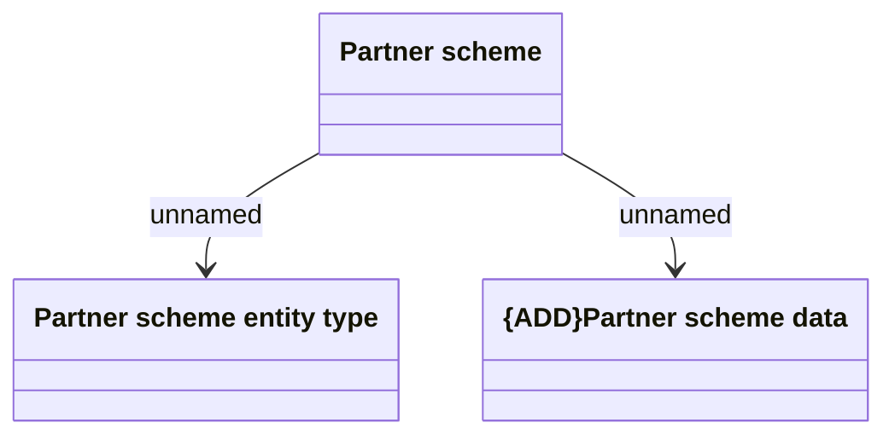

# Partner scheme code

```mermaid
classDiagram
    class ADD_Partner_scheme_data["{ADD}Partner scheme data"]
    class Partner_scheme_entity_type["Partner scheme entity type"]
    class Partner_scheme["Partner scheme"]
    Partner_scheme --> Partner_scheme_entity_type : unnamed
    Partner_scheme --> ADD_Partner_scheme_data : unnamed
```
