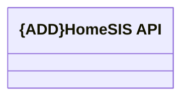

# HomeSIS API

- **Diagram Type**: Logical
- **Package**: HomerSelect/BSL/Modules/Commodity/Interface Consumed/HomeSIS API
- **Diagram ID**: 149640
- **Elements**: 1
- **Connectors**: 0

```mermaid
classDiagram
    class ADD_HomeSIS_API["{ADD}HomeSIS API"]
```
