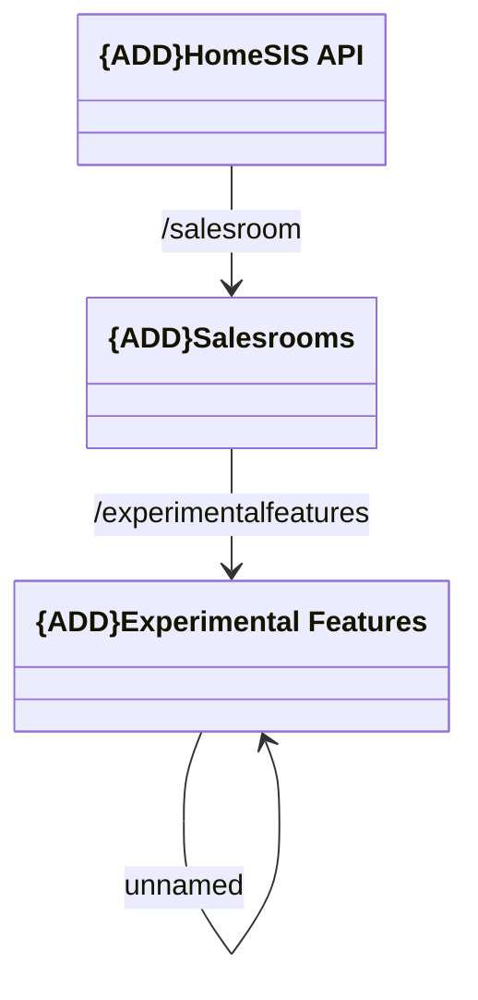

# Salesrooms

```mermaid
classDiagram
    class ADD_Experimental_Features["{ADD}Experimental Features"]
    class ADD_Experimental_Features["{ADD}Experimental Features"]
    class ADD_Salesrooms["{ADD}Salesrooms"]
    class ADD_HomeSIS_API["{ADD}HomeSIS API"]
    ADD_HomeSIS_API --> ADD_Salesrooms : /salesroom
    ADD_Salesrooms --> ADD_Experimental_Features : /experimentalfeatures
    ADD_Experimental_Features --> ADD_Experimental_Features : unnamed
```
