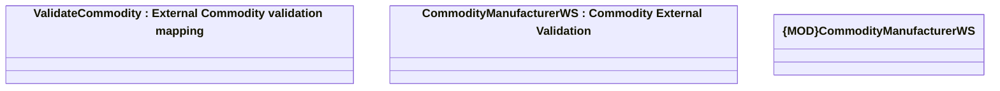

# OSB API

- **Diagram Type**: Logical
- **Package**: HomerSelect/BSL/Modules/Commodity/Interface Consumed/OSB API
- **Diagram ID**: 157500
- **Elements**: 3
- **Connectors**: 0

```mermaid
classDiagram
    class ValidateCommodity_External_Commodity_validation_mapping["ValidateCommodity : External Commodity validation mapping"]
    class CommodityManufacturerWS_Commodity_External_Validation["CommodityManufacturerWS : Commodity External Validation"]
    class MOD_CommodityManufacturerWS["{MOD}CommodityManufacturerWS"]
```
