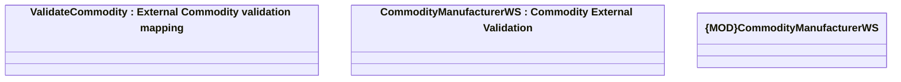

# OSB API

```mermaid
classDiagram
    class ValidateCommodity_External_Commodity_validation_mapping["ValidateCommodity : External Commodity validation mapping"]
    class CommodityManufacturerWS_Commodity_External_Validation["CommodityManufacturerWS : Commodity External Validation"]
    class MOD_CommodityManufacturerWS["{MOD}CommodityManufacturerWS"]
```
