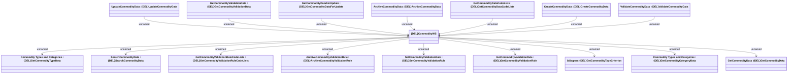

# {DEL}CommodityWS

- **Diagram Type**: Logical
- **Package**: HomerSelect/BSL/Modules/Commodity/Interface Provided
- **Diagram ID**: 150907
- **Elements**: 17
- **Connectors**: 16

```mermaid
classDiagram
    class diagram_DEL_GetCommodityTypeCriterion["$diagram:{DEL}GetCommodityTypeCriterion"]
    class SearchCommodityData_DEL_SearchCommodityData["SearchCommodityData :{DEL}SearchCommodityData"]
    class GetCommodityValidationRuleCodeLists_DEL_GetCommodityValidati["GetCommodityValidationRuleCodeLists :{DEL}GetCommodityValidationRuleCodeLists"]
    class ArchiveCommodityValidationRule_DEL_ArchiveCommodityValidatio["ArchiveCommodityValidationRule :{DEL}ArchiveCommodityValidationRule"]
    class SetCommodityValidationRule_DEL_SetCommodityValidationRule["SetCommodityValidationRule :{DEL}SetCommodityValidationRule"]
    class GetCommodityValidationRule_DEL_GetCommodityValidationRule["GetCommodityValidationRule :{DEL}GetCommodityValidationRule"]
    class GetCommodityValidationData_DEL_GetCommodityValidationData["GetCommodityValidationData :{DEL}GetCommodityValidationData"]
    class ArchiveCommodityData_DEL_ArchiveCommodityData["ArchiveCommodityData :{DEL}ArchiveCommodityData"]
    class GetCommodityDataCodeLists_DEL_GetCommodityDataCodeLists["GetCommodityDataCodeLists :{DEL}GetCommodityDataCodeLists"]
    class CreateCommodityData_DEL_CreateCommodityData["CreateCommodityData :{DEL}CreateCommodityData"]
    class ValidateCommodityData_DEL_ValidateCommodityData["ValidateCommodityData :{DEL}ValidateCommodityData"]
    class UpdateCommodityData_DEL_UpdateCommodityData["UpdateCommodityData :{DEL}UpdateCommodityData"]
    class GetCommodityDataForUpdate_DEL_GetCommodityDataForUpdate["GetCommodityDataForUpdate :{DEL}GetCommodityDataForUpdate"]
    class GetCommodityData_DEL_GetCommodityData["GetCommodityData :{DEL}GetCommodityData"]
    class Commodity_Types_and_Categories_DEL_GetCommodityCategoryData["Commodity Types and Categories :{DEL}GetCommodityCategoryData"]
    class Commodity_Types_and_Categories_DEL_GetCommodityTypeData["Commodity Types and Categories :{DEL}GetCommodityTypeData"]
    class DEL_CommodityWS["{DEL}CommodityWS"]
    DEL_CommodityWS --> Commodity_Types_and_Categories_DEL_GetCommodityTypeData : unnamed
    DEL_CommodityWS --> SearchCommodityData_DEL_SearchCommodityData : unnamed
    DEL_CommodityWS --> GetCommodityValidationRuleCodeLists_DEL_GetCommodityValidati : unnamed
    DEL_CommodityWS --> ArchiveCommodityValidationRule_DEL_ArchiveCommodityValidatio : unnamed
    DEL_CommodityWS --> SetCommodityValidationRule_DEL_SetCommodityValidationRule : unnamed
    DEL_CommodityWS --> GetCommodityValidationRule_DEL_GetCommodityValidationRule : unnamed
    DEL_CommodityWS --> diagram_DEL_GetCommodityTypeCriterion : unnamed
    DEL_CommodityWS --> Commodity_Types_and_Categories_DEL_GetCommodityCategoryData : unnamed
    UpdateCommodityData_DEL_UpdateCommodityData --> DEL_CommodityWS : unnamed
    GetCommodityValidationData_DEL_GetCommodityValidationData --> DEL_CommodityWS : unnamed
    GetCommodityDataForUpdate_DEL_GetCommodityDataForUpdate --> DEL_CommodityWS : unnamed
    ArchiveCommodityData_DEL_ArchiveCommodityData --> DEL_CommodityWS : unnamed
    GetCommodityDataCodeLists_DEL_GetCommodityDataCodeLists --> DEL_CommodityWS : unnamed
    CreateCommodityData_DEL_CreateCommodityData --> DEL_CommodityWS : unnamed
    ValidateCommodityData_DEL_ValidateCommodityData --> DEL_CommodityWS : unnamed
    DEL_CommodityWS --> GetCommodityData_DEL_GetCommodityData : unnamed
```
