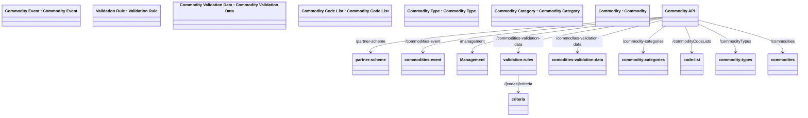

# Commodity REST API

```mermaid
classDiagram
    class partner_scheme["partner-scheme"]
    class Commodity_Event_Commodity_Event["Commodity Event : Commodity Event"]
    class commodities_event["commodities-event"]
    class Management["Management"]
    class Validation_Rule_Validation_Rule["Validation Rule : Validation Rule"]
    class criteria["criteria"]
    class validation_rules["validation-rules"]
    class Commodity_Validation_Data_Commodity_Validation_Data["Commodity Validation Data : Commodity Validation Data"]
    class comodities_validation_data["comodities-validation-data"]
    class commodity_categories["commodity-categories"]
    class Commodity_Code_List_Commodity_Code_List["Commodity Code List : Commodity Code List"]
    class code_list["code-list"]
    class Commodity_Type_Commodity_Type["Commodity Type : Commodity Type"]
    class Commodity_Category_Commodity_Category["Commodity Category : Commodity Category"]
    class Commodity_Commodity["Commodity : Commodity"]
    class commodity_types["commodity-types"]
    class commodites["commodites"]
    class Commodity_API["Commodity API"]
    validation_rules --> criteria : /{codes}/criteria
    Commodity_API --> validation_rules : /commodities-validation-data
    Commodity_API --> commodites : /commodities
    Commodity_API --> commodity_types : /commodityTypes
    Commodity_API --> comodities_validation_data : /commodites-validation-data
    Commodity_API --> code_list : /commodityCodeLists
    Commodity_API --> partner_scheme : /partner-scheme
    Commodity_API --> commodity_categories : /commodity-categories
    Commodity_API --> commodities_event : /commodities-event
    Commodity_API --> Management : /management
```
