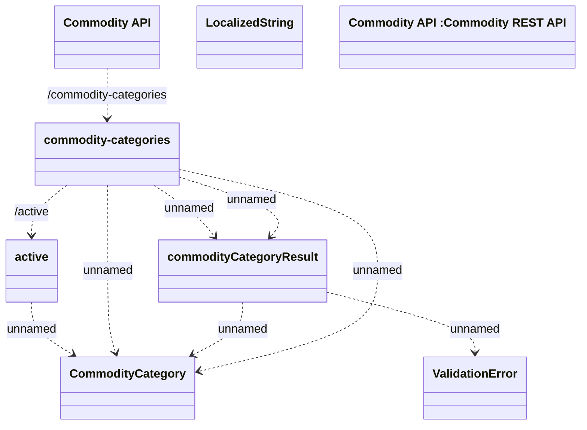

# Commodity Category

- **Diagram Type**: Logical
- **Package**: HomerSelect/BSL/Modules/Commodity/Interface Provided/Commodity API/Commodity Category
- **Diagram ID**: 138987
- **Elements**: 8
- **Connectors**: 9

