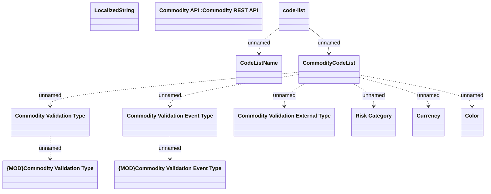

# Commodity Code List

- **Diagram Type**: Logical
- **Package**: HomerSelect/BSL/Modules/Commodity/Interface Provided/Commodity API/Commodity Code List
- **Diagram ID**: 138986
- **Elements**: 13
- **Connectors**: 10

