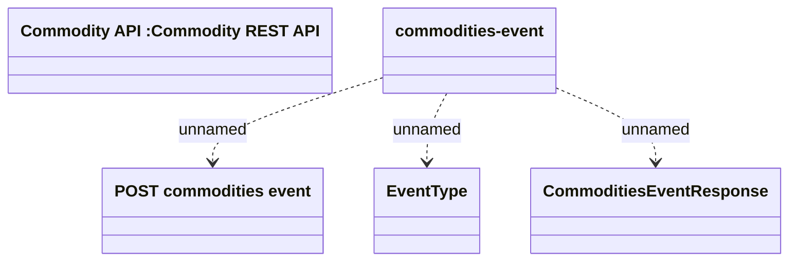

# Commodity Event

- **Diagram Type**: Logical
- **Package**: HomerSelect/BSL/Modules/Commodity/Interface Provided/Commodity API/Commodity Event
- **Diagram ID**: 143856
- **Elements**: 5
- **Connectors**: 3

