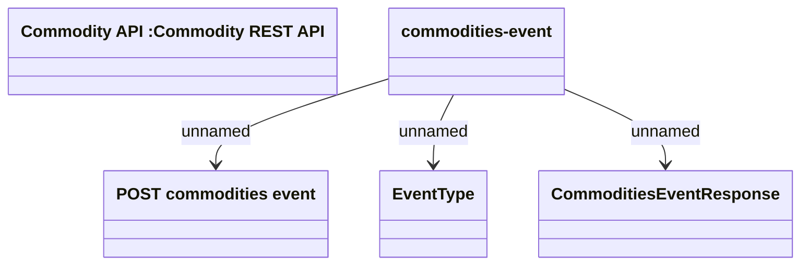

# Commodity Event

```mermaid
classDiagram
    class POST_commodities_event["POST commodities event"]
    class EventType["EventType"]
    class CommoditiesEventResponse["CommoditiesEventResponse"]
    class Commodity_API_Commodity_REST_API["Commodity API :Commodity REST API"]
    class commodities_event["commodities-event"]
    commodities_event --> POST_commodities_event : unnamed
    commodities_event --> EventType : unnamed
    commodities_event --> CommoditiesEventResponse : unnamed
```
