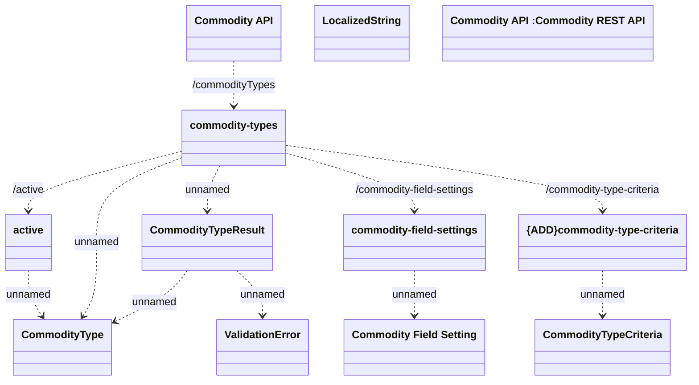

# Commodity Type

- **Diagram Type**: Logical
- **Package**: HomerSelect/BSL/Modules/Commodity/Interface Provided/Commodity API/Commodity Type
- **Diagram ID**: 138995
- **Elements**: 12
- **Connectors**: 11

