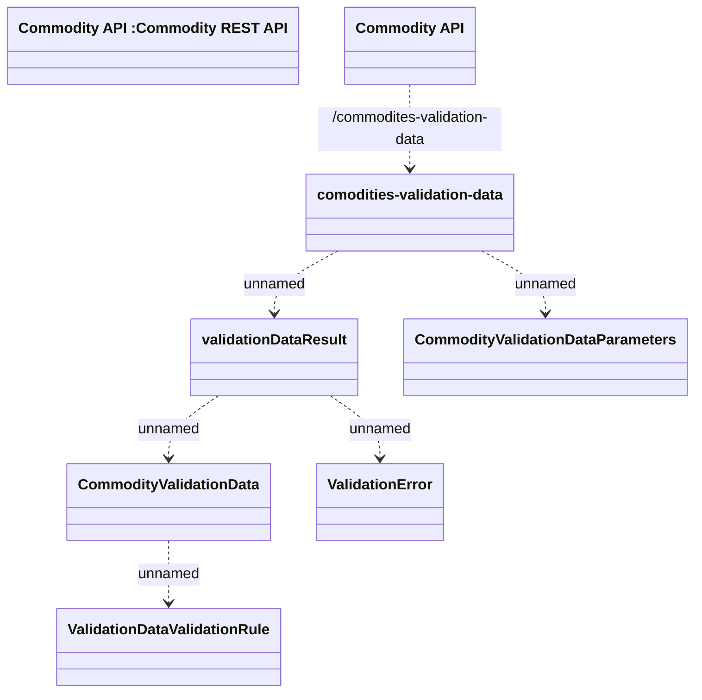

# Commodity Validation Data

- **Diagram Type**: Logical
- **Package**: HomerSelect/BSL/Modules/Commodity/Interface Provided/Commodity API/Commodity Validation Data
- **Diagram ID**: 138996
- **Elements**: 8
- **Connectors**: 6

