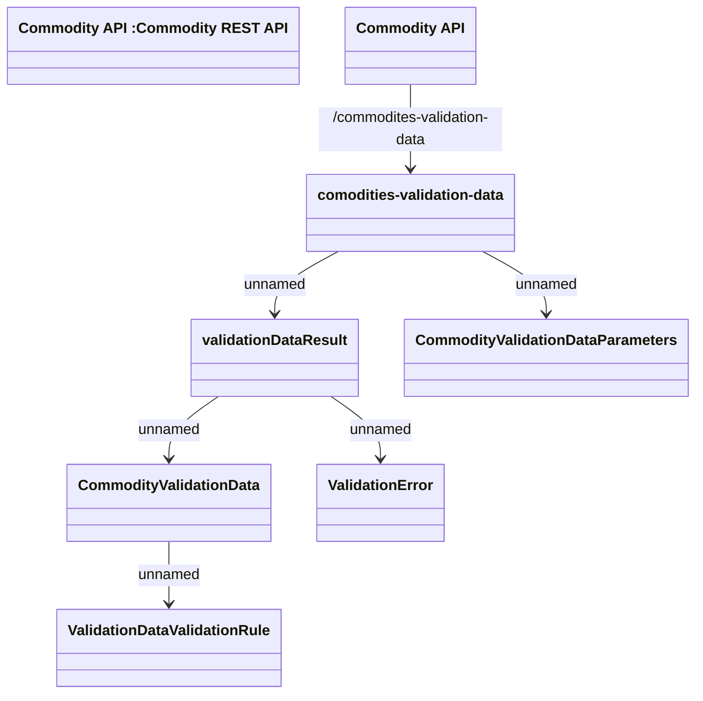

# Commodity Validation Data

```mermaid
classDiagram
    class ValidationDataValidationRule["ValidationDataValidationRule"]
    class CommodityValidationData["CommodityValidationData"]
    class ValidationError["ValidationError"]
    class validationDataResult["validationDataResult"]
    class CommodityValidationDataParameters["CommodityValidationDataParameters"]
    class comodities_validation_data["comodities-validation-data"]
    class Commodity_API_Commodity_REST_API["Commodity API :Commodity REST API"]
    class Commodity_API["Commodity API"]
    comodities_validation_data --> CommodityValidationDataParameters : unnamed
    comodities_validation_data --> validationDataResult : unnamed
    validationDataResult --> ValidationError : unnamed
    validationDataResult --> CommodityValidationData : unnamed
    CommodityValidationData --> ValidationDataValidationRule : unnamed
    Commodity_API --> comodities_validation_data : /commodites-validation-data
```
