# Commodity API

- **Diagram Type**: Logical
- **Package**: HomerSelect/BSL/Modules/Commodity/Interface Provided/Commodity API/Commodity
- **Diagram ID**: 161703
- **Elements**: 12
- **Connectors**: 13

```mermaid
classDiagram
    class Cancel_external_validation["Cancel external validation"]
    class GET_Commodity_for_update["GET Commodity for update"]
    class MOD_POST_Commodity_Validation["{MOD}POST Commodity Validation"]
    class DELETE_Commodity["DELETE Commodity"]
    class PUT_Commodity["PUT Commodity"]
    class POST_Commodity["POST Commodity"]
    class GET_Commodity["GET Commodity"]
    class commodities_validation_cancelation["commodities-validation-cancelation"]
    class commodities_validation["commodities-validation"]
    class commodities_for_update["commodities-for-update"]
    class commodites["commodites"]
    class Commodity_API["Commodity API"]
    Commodity_API ..> commodites : /commodities
    Commodity_API ..> commodities_for_update : /commodities-for-update
    Commodity_API ..> commodities_validation : /commodities-validation
    Commodity_API ..> commodities_validation_cancelation : /commodities-validation-cancelation
    GET_Commodity <|.. commodites : unnamed
    GET_Commodity <|.. commodites : unnamed
    POST_Commodity <|.. commodites : unnamed
    PUT_Commodity <|.. commodites : unnamed
    DELETE_Commodity <|.. commodites : unnamed
    DELETE_Commodity <|.. commodites : unnamed
    MOD_POST_Commodity_Validation <|.. commodities_validation : unnamed
    GET_Commodity_for_update <|.. commodities_for_update : unnamed
    Cancel_external_validation <|.. commodities_validation_cancelation : unnamed
```

