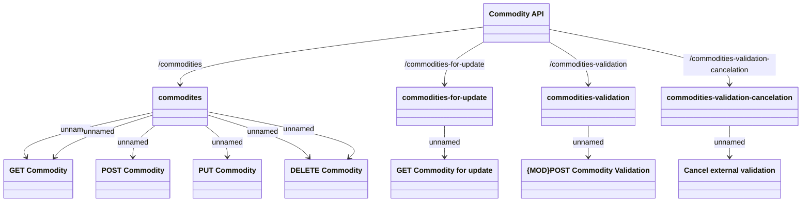

# Commodity API

```mermaid
classDiagram
    class Cancel_external_validation["Cancel external validation"]
    class GET_Commodity_for_update["GET Commodity for update"]
    class MOD_POST_Commodity_Validation["{MOD}POST Commodity Validation"]
    class DELETE_Commodity["DELETE Commodity"]
    class PUT_Commodity["PUT Commodity"]
    class POST_Commodity["POST Commodity"]
    class GET_Commodity["GET Commodity"]
    class commodities_validation_cancelation["commodities-validation-cancelation"]
    class commodities_validation["commodities-validation"]
    class commodities_for_update["commodities-for-update"]
    class commodites["commodites"]
    class Commodity_API["Commodity API"]
    Commodity_API --> commodites : /commodities
    Commodity_API --> commodities_for_update : /commodities-for-update
    Commodity_API --> commodities_validation : /commodities-validation
    Commodity_API --> commodities_validation_cancelation : /commodities-validation-cancelation
    commodites --> GET_Commodity : unnamed
    commodites --> GET_Commodity : unnamed
    commodites --> POST_Commodity : unnamed
    commodites --> PUT_Commodity : unnamed
    commodites --> DELETE_Commodity : unnamed
    commodites --> DELETE_Commodity : unnamed
    commodities_validation --> MOD_POST_Commodity_Validation : unnamed
    commodities_for_update --> GET_Commodity_for_update : unnamed
    commodities_validation_cancelation --> Cancel_external_validation : unnamed
```
