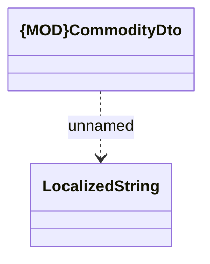

# CommodityDto

- **Diagram Type**: Logical
- **Package**: HomerSelect/BSL/Modules/Commodity/Interface Provided/Commodity API/Commodity
- **Diagram ID**: 161702
- **Elements**: 2
- **Connectors**: 1

