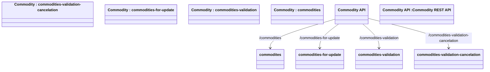

# Commodity

```mermaid
classDiagram
    class Commodity_commodities_validation_cancelation["Commodity : commodities-validation-cancelation"]
    class Commodity_commodities_for_update["Commodity : commodities-for-update"]
    class Commodity_commodities_validation["Commodity : commodities-validation"]
    class Commodity_commodities["Commodity : commodities"]
    class commodities_validation_cancelation["commodities-validation-cancelation"]
    class Commodity_API["Commodity API"]
    class commodities_validation["commodities-validation"]
    class commodities_for_update["commodities-for-update"]
    class Commodity_API_Commodity_REST_API["Commodity API :Commodity REST API"]
    class commodites["commodites"]
    Commodity_API --> commodites : /commodities
    Commodity_API --> commodities_for_update : /commodities-for-update
    Commodity_API --> commodities_validation : /commodities-validation
    Commodity_API --> commodities_validation_cancelation : /commodities-validation-cancelation
```
