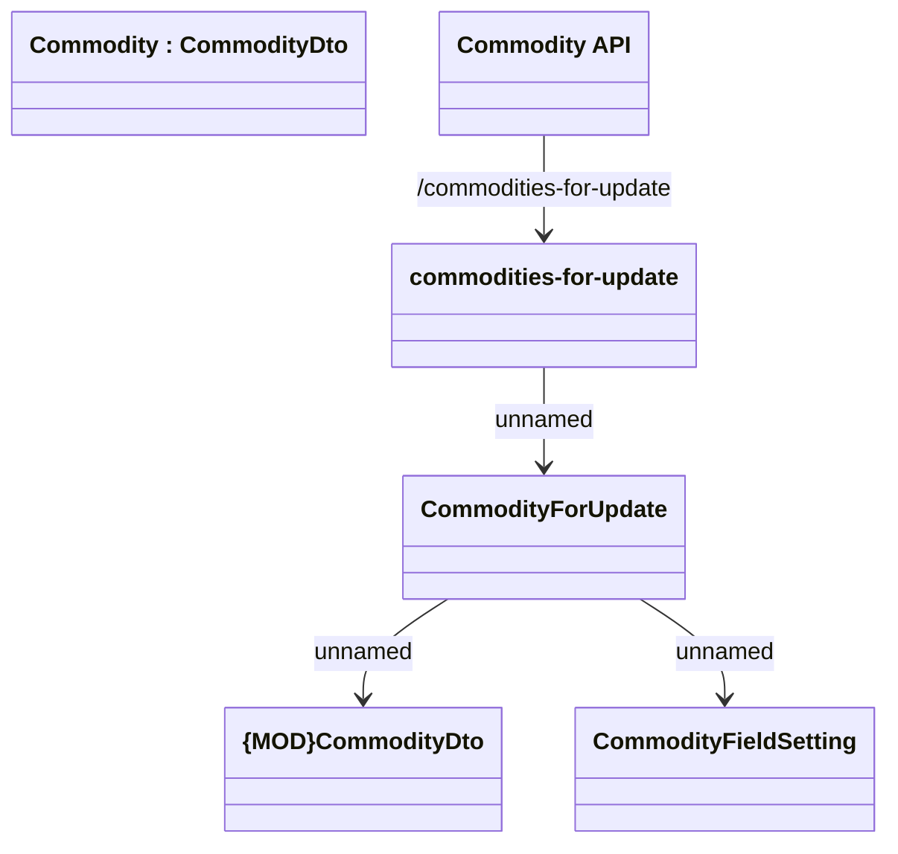

# commodities-for-update

```mermaid
classDiagram
    class CommodityFieldSetting["CommodityFieldSetting"]
    class Commodity_CommodityDto["Commodity : CommodityDto"]
    class MOD_CommodityDto["{MOD}CommodityDto"]
    class CommodityForUpdate["CommodityForUpdate"]
    class commodities_for_update["commodities-for-update"]
    class Commodity_API["Commodity API"]
    Commodity_API --> commodities_for_update : /commodities-for-update
    commodities_for_update --> CommodityForUpdate : unnamed
    CommodityForUpdate --> MOD_CommodityDto : unnamed
    CommodityForUpdate --> CommodityFieldSetting : unnamed
```
