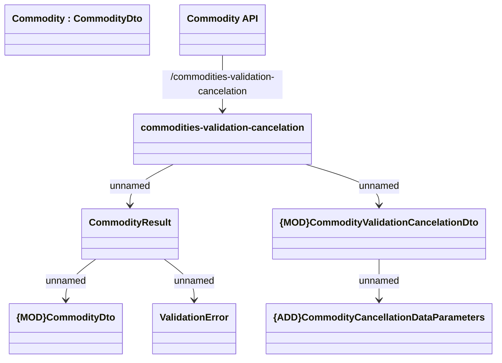

# commodities-validation-cancelation

```mermaid
classDiagram
    class ADD_CommodityCancellationDataParameters["{ADD}CommodityCancellationDataParameters"]
    class MOD_CommodityValidationCancelationDto["{MOD}CommodityValidationCancelationDto"]
    class ValidationError["ValidationError"]
    class Commodity_CommodityDto["Commodity : CommodityDto"]
    class MOD_CommodityDto["{MOD}CommodityDto"]
    class CommodityResult["CommodityResult"]
    class commodities_validation_cancelation["commodities-validation-cancelation"]
    class Commodity_API["Commodity API"]
    Commodity_API --> commodities_validation_cancelation : /commodities-validation-cancelation
    commodities_validation_cancelation --> CommodityResult : unnamed
    CommodityResult --> MOD_CommodityDto : unnamed
    CommodityResult --> ValidationError : unnamed
    commodities_validation_cancelation --> MOD_CommodityValidationCancelationDto : unnamed
    MOD_CommodityValidationCancelationDto --> ADD_CommodityCancellationDataParameters : unnamed
```
