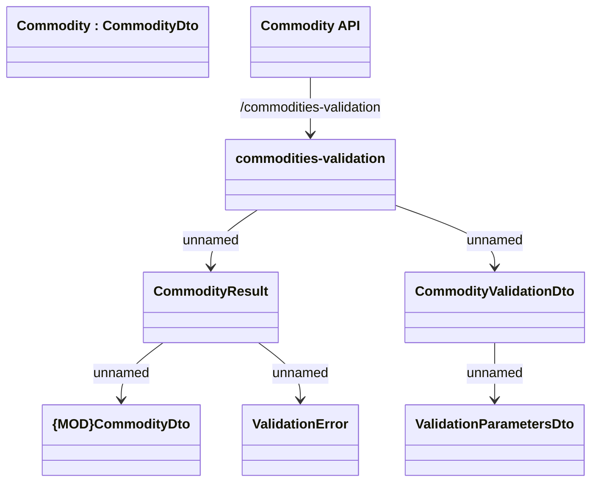

# commodities-validation

```mermaid
classDiagram
    class ValidationError["ValidationError"]
    class Commodity_CommodityDto["Commodity : CommodityDto"]
    class MOD_CommodityDto["{MOD}CommodityDto"]
    class ValidationParametersDto["ValidationParametersDto"]
    class CommodityValidationDto["CommodityValidationDto"]
    class CommodityResult["CommodityResult"]
    class commodities_validation["commodities-validation"]
    class Commodity_API["Commodity API"]
    Commodity_API --> commodities_validation : /commodities-validation
    commodities_validation --> CommodityResult : unnamed
    commodities_validation --> CommodityValidationDto : unnamed
    CommodityValidationDto --> ValidationParametersDto : unnamed
    CommodityResult --> MOD_CommodityDto : unnamed
    CommodityResult --> ValidationError : unnamed
```
