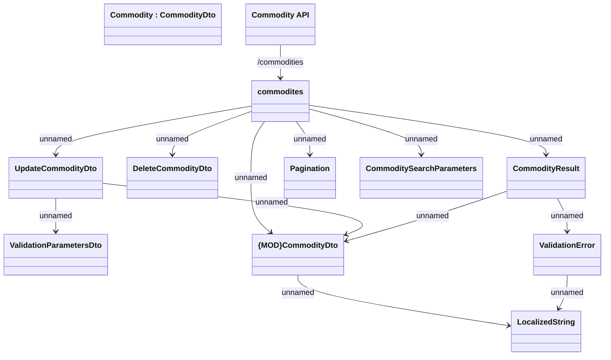

# commodities

```mermaid
classDiagram
    class Commodity_CommodityDto["Commodity : CommodityDto"]
    class Commodity_API["Commodity API"]
    class ValidationParametersDto["ValidationParametersDto"]
    class MOD_CommodityDto["{MOD}CommodityDto"]
    class CommodityResult["CommodityResult"]
    class DeleteCommodityDto["DeleteCommodityDto"]
    class UpdateCommodityDto["UpdateCommodityDto"]
    class LocalizedString["LocalizedString"]
    class ValidationError["ValidationError"]
    class Pagination["Pagination"]
    class CommoditySearchParameters["CommoditySearchParameters"]
    class commodites["commodites"]
    Commodity_API --> commodites : /commodities
    commodites --> CommoditySearchParameters : unnamed
    commodites --> Pagination : unnamed
    CommodityResult --> ValidationError : unnamed
    MOD_CommodityDto --> LocalizedString : unnamed
    ValidationError --> LocalizedString : unnamed
    commodites --> UpdateCommodityDto : unnamed
    commodites --> DeleteCommodityDto : unnamed
    commodites --> CommodityResult : unnamed
    commodites --> MOD_CommodityDto : unnamed
    UpdateCommodityDto --> MOD_CommodityDto : unnamed
    CommodityResult --> MOD_CommodityDto : unnamed
    UpdateCommodityDto --> ValidationParametersDto : unnamed
```
