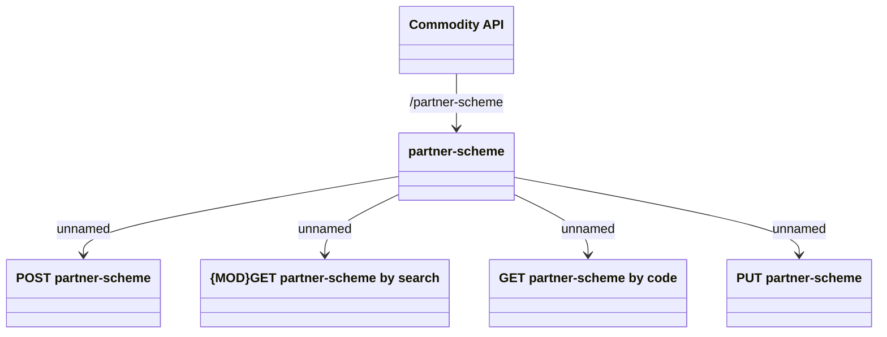

# Partner Scheme API

```mermaid
classDiagram
    class PUT_partner_scheme["PUT partner-scheme"]
    class GET_partner_scheme_by_code["GET partner-scheme by code"]
    class MOD_GET_partner_scheme_by_search["{MOD}GET partner-scheme by search"]
    class POST_partner_scheme["POST partner-scheme"]
    class partner_scheme["partner-scheme"]
    class Commodity_API["Commodity API"]
    partner_scheme --> POST_partner_scheme : unnamed
    partner_scheme --> MOD_GET_partner_scheme_by_search : unnamed
    partner_scheme --> GET_partner_scheme_by_code : unnamed
    partner_scheme --> PUT_partner_scheme : unnamed
    Commodity_API --> partner_scheme : /partner-scheme
```
